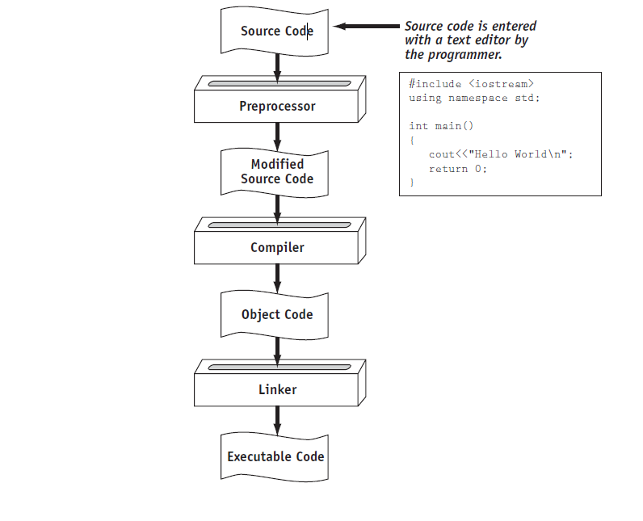
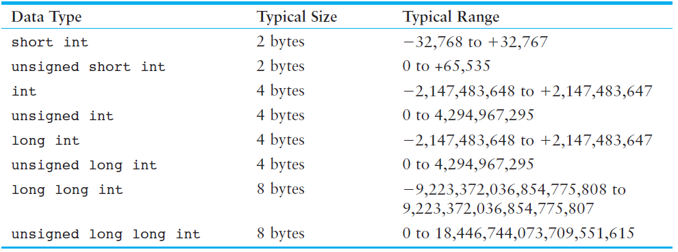
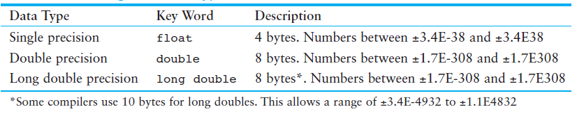
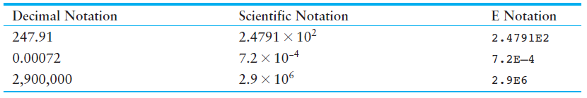

# Review Session for Section 1 - 6

## Correction and Clarification
- In Component 29 of Section 4, actually all the errors mentioned here are commonly referred to as Syntax errors. While semantic errors are usually used interchangebly with Logic errors (Section 4 Component 33)
- In Component 48 of Section 6, you don't need to use 
```cpp
#include <climits>
```
in order to use 

```cpp
sizeof()

```
function. ``` sizeof()``` function is a build-in function of C++. However, you need to include ```<climits>``` or ```<cfloat>``` if you want to have access to constants like INT_MIN, LONG_MAX	and so forth. 

Just want to clarify this since this section seemingly implies that you must include those external libraries in order to use ```sizeof()```, which is in fact not the case.

- Summary of the process of translating a C++ source file into an executable file 


- There is no ```;``` in the end when you use the preprocessor directive ```#include<>```.
## Review Questions

Q1. The following C++ program will not compile because the lines have been mixed up.
``` cpp
int main()
}
// A crazy mixed up program
return 0;
#include <iostream>
cout << "In 1492 Columbus sailed the ocean blue.";
{
using namespace std;
```

When the lines are properly arranged the program should display the following on the screen:
```
In 1492 Columbus sailed the ocean blue.
```
Rearrange the lines in the correct order. Test the program by entering it on the computer, compiling it, and running it.

Q2. The following C++ program will not compile because the lines have been mixed up.
``` cpp
cout << "Success\n";
cout << " Success\n\n";
int main()
cout << "Success";
}
using namespace std;
// It's a mad, mad program
#include <iostream>
cout << "Success\n";
{
return 0;
```
When the lines are properly arranged the program should display the following on the screen:
```
Success
Success Success

Success
```

Rearrange the lines in the correct order. Test the program by entering it on the computer, compiling it, and running it.

Q3. Study the following program and show what it will print on the screen.
``` cpp
// The Works of Wolfgang
#include <iostream>
using namespace std;
int main()
{
  cout << "The works of Wolfgang\ninclude the following";
  cout << "\nThe Turkish March" << endl;
  cout << "and Symphony No. 40 ";
  cout << "in G minor." << endl;
  return 0;
}
```

Q4. Examine the following program.
``` cpp
// This program uses variables and literals.
#include <iostream>
using namespace std;
int main()
{
  int little;
  int big;
  little = 2;
  big = 2000;
  cout << "The little number is " << little << endl;
  cout << "The big number is " << big << endl;
  return 0;
}
  ```
List all the variables and literals that appear in the program.
  
Q5. What will the following program display on the screen?
``` cpp
#include <iostream>
using namespace std;
int main()
{
  int number {712};
  cout << "The value is " << "number" << endl;
  return 0;
}
```
Q6. Which of the following are illegal variable names, and why?
```cpp
X
99bottles
july97
theSalesFigureForFiscalYear98
r&d
grade_report
```

Here are some specific rules that must be followed with all identifiers.
- The first character must be one of the letters a through z, A through Z, or an underscore
character (_).
-  After the first character you may use the letters a through z or A through Z, the digits
0 through 9, or underscores.
- Uppercase and lowercase characters are distinct. This means `ItemsOrdered` is not the
same as `itemsordered`.

Q7. 
- If a variable needs to hold numbers in the range 32 to 6,000, what data type
would be best?
- If a variable needs to hold numbers in the range 240,000 to 1,400,000, what
data type would be best?
- Which of the following literals uses more memory? 20 or 20L




Q8. 
Write a program that defines an integer variable named age and a float variable named weight . Store your age and weight, as literals, in the variables.
The program should display these values on the screen in a manner similar to the following:
```
My age is 26 and my weight is 180 pounds.
```
(Feel free to lie to the computer about your age and your weight, it’ll never know!)

Q9. Is the following assignment statement valid or invalid? If it is invalid, why?
```cpp
72 = amount;
```

Q10. How would you consolidate the following definitions into one statement?
``` cpp
int x = 7;
int y = 16;
int z = 28;
```

Q11. What is wrong with the following program? How would you correct it?
``` cpp
#include <iostream>
using namespace std;
int main()
{
number = 62.7;
double number;
cout << number << endl;
return 0;
}
```
Q12. Is the following an example of integer division or floating-point division? What value will be stored in portion ?
``` cpp
portion = 70 / 3;
```

Q13. Convert the following pseudocode to C++ code. Be sure to define the appropriate variables.
- Store 20 in the speed variable.
- Store 10 in the time variable.
- Multiply speed by time and store the result in the distance variable.
- Display the contents of the distance variable.

Q14. Convert the following pseudocode to C++ code. Be sure to define the appropriate variables.
- Store 172.5 in the force variable.
- Store 27.5 in the area variable.
- Divide area by force and store the result in the pressure variable.
- Display the contents of the pressure variable.

Q15. There are a number of syntax errors in the following program. Locate as many as you can.

``` cpp
*/ What's wrong with this program? /*
#include iostream
using namespace std;
int main();
}
int a, b, c \\ Three integers
a = 3
b = 4
c = a + b
Cout < "The value of c is %d" < C;
```
